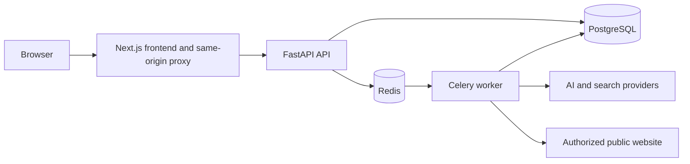

# GeoLens architecture

## Status and scope

This document describes the GeoLens 0.1.0 release-candidate topology:

- project and comparison-set persistence;
- secure website crawling;
- asynchronous provider analysis;
- provider-neutral response normalization;
- deterministic visibility measurement;
- opt-in model-assisted claim classification;
- evidence-linked recommendations;
- a Next.js evidence dashboard.

Authentication, authorization, tenant isolation, and production observability are
not implemented.

## System context



Provider credentials remain on the backend. Browser code never receives provider
keys.

User-supplied crawl targets reach the crawler worker only after URL validation,
public-address resolution, private-network rejection, and address pinning.

## Components

### Frontend

The Next.js TypeScript application owns:

- project onboarding and switching;
- target-brand and competitor configuration;
- explicit website-crawl launch;
- crawl-status polling;
- provider and query selection;
- asynchronous analysis launch;
- analysis-status polling;
- deterministic metric presentation;
- citation and entity evidence views;
- claim review;
- ranked GEO recommendations.

Browser requests use the same-origin `/api/geolens` route. The Next.js server
reads the server-only `GEOLENS_API_URL`; provider credentials are never exposed
through public frontend environment variables.

For the active project, the frontend queues a crawl through:

```text
POST /sites/{site_id}/crawls
```

It polls:

```text
GET /crawls/{crawl_id}
```

approximately every two seconds while the crawl is `pending` or `running`.
Polling stops when the job succeeds, fails, the project changes, or the component
is cleaned up.

Only a succeeded crawl belonging to the active project is passed as
`crawl_job_id` when an analysis is submitted.

The frontend starts an analysis through:

```text
POST /analyses
```

The API returns HTTP 202 with a persisted pending run. The frontend then polls:

```text
GET /analyses/{analysis_id}
```

until the run reaches:

- `succeeded`
- `completed_with_errors`
- `failed`

Persisted citation, entity, score, and claim endpoints are loaded after analysis
completion.

### Backend API

The FastAPI application owns the HTTP boundary and exposes:

- `GET /health` — process liveness;
- `GET /ready` — PostgreSQL readiness;
- `POST /projects` — create a project aggregate;
- `GET /projects` — list projects;
- `GET /projects/{project_id}` — retrieve a project;
- `POST /sites/{site_id}/crawls` — validate and queue a crawl;
- `GET /crawls/{crawl_id}` — retrieve crawl status and counts;
- `GET /providers` — report provider availability;
- `POST /analyses` — persist and queue an analysis;
- `GET /analyses/{analysis_id}` — retrieve analysis status and normalized
  provider results;
- `GET /analyses/{analysis_id}/citations` — retrieve normalized citations;
- `GET /analyses/{analysis_id}/entities` — retrieve entity mentions;
- `GET /analyses/{analysis_id}/scores` — retrieve deterministic scores and
  disclosed claim-support risk;
- `GET /analyses/{analysis_id}/claims` — retrieve claims and linked evidence;
- FastAPI-generated OpenAPI documentation.

Routes validate and serialize HTTP data. Services coordinate use cases and
transactions. Repositories own SQLAlchemy persistence queries.

The backend uses a `src` package layout so application imports resolve from the
installed package rather than from the repository working directory.

### Analysis submission

When `POST /analyses` receives a valid request, the API:

1. validates the project;
2. validates the optional crawl and project relationship;
3. resolves each selected provider to an exact provider/model configuration;
4. resolves the optional claim-classifier configuration;
5. persists a pending analysis run;
6. persists prompts and exact provider/model identifiers;
7. queues the analysis UUID through Redis and Celery;
8. returns HTTP 202.

Persisting exact provider/model configurations prevents a queued job from
silently running against a different model after an environment change.

If the worker's active provider model does not match the queued configuration,
the job fails rather than substituting another provider or model.

### Celery worker

The Celery worker executes both crawl jobs and provider-analysis jobs.

For an analysis job, the worker:

1. loads the persisted run;
2. marks it `running`;
3. reconstructs the exact provider configuration;
4. verifies model-configuration consistency;
5. executes the provider/prompt matrix;
6. normalizes responses, citations, errors, token usage, and latency;
7. calculates deterministic visibility metrics;
8. retrieves crawl and citation evidence;
9. optionally runs explicit claim classification;
10. persists scores, entities, claims, and evidence;
11. marks the run `succeeded`, `completed_with_errors`, or `failed`.

Provider failures are preserved as normalized execution results. Failed,
disabled, rate-limited, and timed-out executions are excluded from deterministic
metric denominators.

### Provider adapters

Provider clients are created on the backend and conform to a provider-neutral
contract containing:

- provider name;
- model identifier;
- response text;
- normalized citations;
- raw response JSON;
- token usage;
- latency;
- status;
- structured errors.

`MockProvider` supplies deterministic local responses.

The live adapters currently support:

- OpenAI Responses API with hosted web search;
- Gemini with Google Search grounding;
- Perplexity Sonar.

Each adapter owns its provider-specific request and citation parsing at the
infrastructure edge.

Shared HTTP behavior applies:

- request timeouts;
- bounded retries;
- exponential backoff;
- bounded `Retry-After` handling;
- explicit rate-limit errors.

Missing credentials install a disabled provider under its own name. GeoLens
never silently falls back from one provider to another.

Live-provider credentials require an explicit model identifier. Model names are
environment-configured because provider access and model availability can change.

### Analysis boundaries

The framework-independent `geolens_api.analysis` package owns:

- alias and competitor matching;
- normalized citation-domain extraction;
- mention position;
- deterministic entity extraction;
- evidence chunking and retrieval;
- visibility formulas;
- citation formulas;
- rank-weighted share-of-voice calculation;
- entity coverage;
- deterministic aggregation of claim assessments.

It does not depend on FastAPI, SQLAlchemy, Redis, Celery, Next.js, or concrete
provider adapters.

The claim-classifier protocol separates deterministic evidence processing from
model judgment.

A classifier evaluates only a segmented claim against retrieved evidence.
Persistence records:

- classification;
- confidence;
- explanation;
- provider;
- model identifier;
- evidence references.

Aggregate claim-support risk is disclosed as a model-assisted prioritization
estimate and never represented as objective truth.

### PostgreSQL

PostgreSQL stores:

- projects;
- primary sites;
- competitors;
- crawl jobs;
- crawl pages;
- crawl errors;
- analysis runs;
- queued prompts;
- exact provider/model configurations;
- Celery task identifiers;
- provider responses;
- raw provider JSON;
- normalized citations;
- entity mentions;
- deterministic scores;
- claims;
- claim evidence.

SQLAlchemy provides asynchronous database sessions through `asyncpg`. Alembic
owns schema migrations. Primary keys are UUIDs, and timestamps are
timezone-aware.

### Crawler

The crawler:

- accepts only HTTP and HTTPS targets;
- rejects credentials embedded in URLs;
- rejects localhost, private, link-local, metadata, multicast, reserved, and
  otherwise non-public addresses;
- resolves and pins public addresses before connecting;
- revalidates redirects;
- remains on the configured hostname;
- reads robots rules;
- discovers and prioritizes sitemap URLs;
- normalizes and deduplicates URLs;
- streams bounded responses;
- records per-page errors;
- processes page work in deterministic batches.

HTML extraction stores:

- canonical URL;
- title;
- meta description;
- headings;
- main text;
- JSON-LD;
- internal links;
- SHA-256 content hash.

JavaScript rendering is optional behind an interface. No renderer is bundled in
GeoLens 0.1.0.

### Redis and job queues

Redis acts as the Celery broker and result backend.

The API commits a pending crawl or analysis record before enqueueing its UUID.
The queue contains identifiers rather than complete provider responses or secret
credentials.

Queue failures are surfaced as HTTP 503 errors instead of silently executing
work synchronously.

### Runtime topology

Docker Compose provides five services:

```text
postgres
redis
api
worker
frontend
```

PostgreSQL and Redis health gate API startup. API database readiness gates the
worker and frontend.

The API entrypoint runs:

```text
alembic upgrade head
```

before starting Uvicorn.

The API and worker use the same backend image and run as an unprivileged
application user. Only the API container applies startup migrations.

This migration approach is acceptable for the single-API Compose topology. A
scaled deployment should use one external serialized migration job.

### Health semantics

`GET /health` confirms that the API process can serve HTTP.

`GET /ready` performs a database query and returns HTTP 503 when PostgreSQL is
unavailable.

Redis failures during crawl or analysis submission are returned as HTTP 503 and
recorded where applicable.

### Configuration

Configuration is supplied through environment variables.

`.env.example` contains non-sensitive local defaults and can be copied to
`.env`. Real credentials must never be committed.

Configurable values include:

- database URL;
- Redis URL;
- crawl limits;
- provider API keys;
- provider model identifiers;
- provider base URLs;
- request timeouts;
- retry limits;
- backoff limits.

Empty provider credentials disable the provider. A configured live-provider
credential requires a corresponding explicit model identifier.

### Dependency direction

Code should preserve this direction:

```text
HTTP/UI adapters -> application use cases -> domain definitions
                                |
                                v
                     infrastructure adapters
```

Framework and provider objects remain at the boundaries. Metric definitions do
not depend on FastAPI, Next.js, provider SDKs, PostgreSQL, Redis, or Celery.

## Deferred decisions

The following remain intentionally outside GeoLens 0.1.0:

- authentication and authorization;
- tenant isolation;
- production observability;
- audit logs;
- deployment platform;
- TLS termination;
- API versioning;
- historical analysis comparison;
- historical crawl selection;
- scheduled analyses;
- analysis cancellation and manual retry controls;
- aggregation windows beyond one analysis run;
- generated API clients;
- a JavaScript renderer that applies the crawler SSRF policy to every
  subresource.
