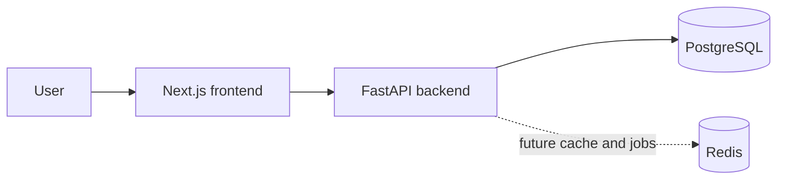

# GeoLens architecture

## Status and scope

This document describes the project foundation and project-management persistence layer. The
repository does not yet contain provider integrations, prompt execution, citation extraction,
metric computation, authentication, or other business workflows.

## System context



The dashed Redis connection represents infrastructure configured locally but not used by
application code yet.

## Components

### Frontend

The Next.js TypeScript application owns browser-facing presentation and, in future, will call
the backend over HTTP. The initial application is a static placeholder with no business
behavior. `NEXT_PUBLIC_API_URL` is the public backend base URL.

### Backend

The FastAPI application owns the HTTP API boundary. It exposes:

- `GET /health` for process health
- `GET /ready` for PostgreSQL readiness
- `POST /projects` to create a project aggregate
- `GET /projects/{project_id}` to retrieve a project
- `GET /projects` to list projects
- FastAPI's generated OpenAPI schema and documentation

Routes validate and serialize HTTP data, services coordinate use cases and transactions, and
repositories own SQLAlchemy queries. The package uses a `src` layout so imports resolve from
the installed application rather than the repository working directory.

### PostgreSQL

PostgreSQL stores projects, their primary sites and competitors, plus crawl-job and
analysis-run lifecycle records. SQLAlchemy provides asynchronous sessions through `asyncpg`;
Alembic owns schema migrations. Primary keys are UUIDs and all timestamps are timezone-aware.

### Redis

Redis is reserved for ephemeral caching, rate coordination, and/or background job
infrastructure. No queue library or key design is selected yet.

## Runtime topology

Docker Compose supplies one container for each component and health checks for PostgreSQL,
Redis, and the backend. The frontend waits for the backend's process health; the backend waits
for its future infrastructure dependencies to accept connections.

The `/health` response means only that the API process can serve HTTP. `/ready` executes a
database query and returns HTTP 503 while PostgreSQL is unavailable. Redis is not part of
readiness because no application workflow depends on it yet.

## Configuration

Configuration is passed through environment variables. `.env.example` contains local,
non-sensitive defaults and may be copied to `.env`. Real secrets must never be committed.
Provider-specific keys are outside the current scope.

## Dependency direction

Future code should preserve these boundaries:

```text
HTTP/UI adapters -> application use cases -> domain definitions
                                |
                                v
                     infrastructure adapters
```

Framework and provider objects should remain at the edges. Domain metric definitions should
not depend on FastAPI, Next.js, a model provider, PostgreSQL, or Redis.

## Deferred decisions

The following choices require business requirements and are intentionally open:

- authentication, authorization, and tenant isolation
- background task and scheduling framework
- AI/search provider contracts
- observability and deployment platform
- API versioning and generated client strategy
- metric materialization and aggregation windows
