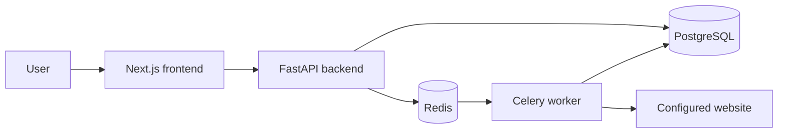

# GeoLens architecture

## Status and scope

This document describes the project foundation, project persistence, and secure crawl
pipeline. The repository does not yet contain provider integrations, prompt execution,
citation extraction, metric computation, or authentication.

## System context



## Components

### Frontend

The Next.js TypeScript application owns browser-facing presentation and, in future, will call
the backend over HTTP. The initial application is a static placeholder with no business
behavior. `NEXT_PUBLIC_API_URL` is the public backend base URL.

### Backend

The FastAPI application owns the HTTP API boundary. It exposes:

- `GET /health` for process health
- `GET /ready` for PostgreSQL readiness
- `POST /projects` to create a project aggregate
- `GET /projects/{project_id}` to retrieve a project
- `GET /projects` to list projects
- `POST /sites/{site_id}/crawls` to validate a site and queue a crawl
- `GET /crawls/{crawl_id}` to read crawl status and result counts
- FastAPI's generated OpenAPI schema and documentation

Routes validate and serialize HTTP data, services coordinate use cases and transactions, and
repositories own SQLAlchemy queries. The package uses a `src` layout so imports resolve from
the installed application rather than the repository working directory.

### PostgreSQL

PostgreSQL stores projects, their primary sites and competitors, crawl-job and analysis-run
lifecycle records, extracted crawl pages, and per-URL crawl errors. SQLAlchemy provides
asynchronous sessions through `asyncpg`; Alembic owns schema migrations. Primary keys are
UUIDs and all timestamps are timezone-aware.

### Crawler and worker

Redis is the Celery broker and result backend. The API commits a pending crawl job before
enqueuing its UUID. A worker marks it running, crawls with HTTPX, persists extracted pages and
errors, and records terminal counts and status.

The crawler resolves and pins public IP addresses before connecting, revalidates redirects,
stays on the exact configured hostname, parses robots and sitemaps, and streams bounded
responses. Sitemap URLs have deterministic priority over link-discovered URLs. Page work is
processed in stable batches so concurrency cannot change the selected page set. Canonical
identities and normalized URLs are deduplicated.

HTML extraction stores canonical URL, title, description, headings, main text, JSON-LD,
internal links, and a SHA-256 hash of the fetched content. JavaScript rendering is optional
behind an interface whose implementations must enforce the same hostname, address, timeout,
and size policies; Playwright is not installed by default.

## Runtime topology

Docker Compose supplies one container for each component and health checks for PostgreSQL,
Redis, and the backend. The API and worker wait for PostgreSQL and Redis; the frontend waits
for the backend's process health.

The `/health` response means only that the API process can serve HTTP. `/ready` executes a
database query and returns HTTP 503 while PostgreSQL is unavailable. A Redis failure during
crawl creation is surfaced as HTTP 503 and persisted on the crawl job.

## Configuration

Configuration is passed through environment variables. `.env.example` contains local,
non-sensitive defaults and may be copied to `.env`. Real secrets must never be committed.
Provider-specific keys are outside the current scope.

## Dependency direction

Future code should preserve these boundaries:

```text
HTTP/UI adapters -> application use cases -> domain definitions
                                |
                                v
                     infrastructure adapters
```

Framework and provider objects should remain at the edges. Domain metric definitions should
not depend on FastAPI, Next.js, a model provider, PostgreSQL, or Redis.

## Crawl configuration

Crawler limits use `GEOLENS_CRAWLER_*` environment variables. The checked-in example covers
page count, depth, decoded response bytes, total request timeout, in-crawl concurrency,
redirect count, sitemap count, renderer fallback threshold, and user agent.

## Deferred decisions

The following choices require business requirements and are intentionally open:

- authentication, authorization, and tenant isolation
- AI/search provider contracts
- observability and deployment platform
- API versioning and generated client strategy
- metric materialization and aggregation windows
